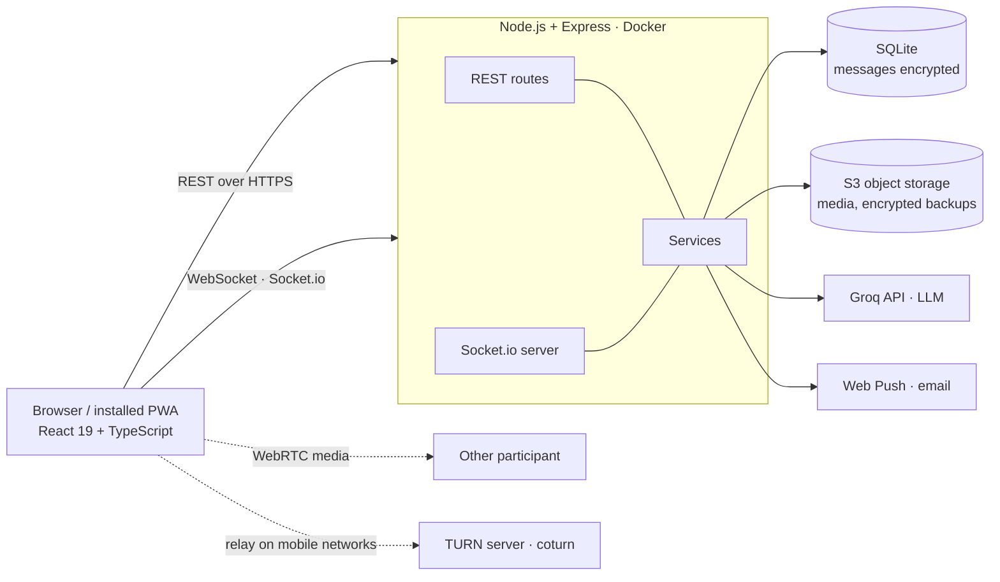

# Blizkie — a private messenger for family and close friends

Blizkie (Russian for "close ones") is a full-stack web messenger, installable as a PWA, with real-time chat, voice and video calls, encryption of stored messages and three AI features. It was built by a single developer working with AI coding agents (Claude Code and ChatGPT) and piloted with a small group of users.

**Live app:** [messenger-web-dk.vercel.app](https://messenger-web-dk.vercel.app) (registration with email verification) · Interface: English / Russian

---

## Features

**Messaging**
- One-to-one and group chats in real time (Socket.io): typing indicators, read receipts, presence
- Replies, forwarding, reactions, pinned messages, editing and deletion, scheduled messages
- Photos, videos, files, voice messages and round video notes with waveform visualisation
- Stickers (including a sticker studio for custom packs), GIFs, polls, link previews
- Search across chats over encrypted messages (blind index, see Security)
- Chat folders, notes, shared file collections, custom chat and app backgrounds
- "Question of the day": a daily prompt for the family with answers, streaks and an archive

**Calls**
- Voice and video calls over WebRTC, with a TURN relay for mobile networks
- Incoming-call push notifications, call history, output-device switching

**AI features** (GPT-OSS 120B via Groq, OpenAI-compatible API; the model is configurable)
- **Chat summary**: a short recap of recent messages for a chosen period
- **In-app help assistant**: answers "how do I…" questions strictly from a 39-topic knowledge base; navigation buttons are attached by the app from topic IDs, so the model cannot invent actions; questions outside the knowledge base get an honest "not covered" plus a link to support
- **Personal data assistant** ("second brain"): answers questions about the user's own chats ("When is the dinner?"). Strictly opt-in, scoped to chats the user selects, every answer must cite a source message, decrypted text stays in memory only, and structured facts such as birthdays are answered without the LLM at all

**Accounts and administration**
- Email registration with one-time codes, password reset, two-factor authentication (TOTP), passkeys (WebAuthn)
- Data export and full account deletion
- Admin panel: statistics, users, chats, moderation of reports, error log and audit log
- Full English and Russian localisation, including emails and push notifications in the recipient's language

## Architecture



| Layer | Technology |
|---|---|
| Front end | React 19, TypeScript, Vite, Zustand, react-i18next, PWA with a custom service worker |
| Back end | Node.js, Express, Socket.io, better-sqlite3 (22 versioned migrations) |
| Media | S3-compatible object storage with presigned uploads, sharp for image processing |
| AI | Groq (GPT-OSS 120B) through a shared OpenAI-compatible client with automatic fallback when a provider retires a model; provider and model are configurable |
| Hosting | Back end in Docker on Amvera, front end on Vercel, CI on GitHub Actions |
| Monitoring | Sentry-compatible error tracking (Hawk) with request bodies and identities scrubbed |

## Security and privacy

- **Message encryption at rest:** message text is stored only as AES-256-GCM ciphertext; there is no plaintext column. Search works through a blind index of keyed HMAC hashes of word prefixes, so the database never holds readable text. (This is server-side encryption, not end-to-end.)
- **Encrypted backups:** database backups are encrypted by the application before upload, so storage credentials alone reveal nothing.
- **Authentication:** bcrypt password hashes, short-lived JWT access tokens with refresh-token rotation, revocable sessions, optional TOTP and passkeys.
- **Web hardening:** strict Content Security Policy, an Origin check on every state-changing request (CSRF protection), rate limits on sensitive endpoints, safe serving of user uploads.
- **Secrets:** environment variables only; a pre-commit hook blocks accidental commits of keys and local databases.

## Quality

- **~265 automated tests**: 241 back-end tests (Node test runner, including real Socket.io call flows and HTTP-level auth tests) and 25 front-end tests (Vitest, Testing Library)
- CI runs the full back-end suite and a strict TypeScript build on every push; deployment happens only when they pass
- Manual QA passes against the live app, documented in [`docs/QA_FUNCTIONAL_MAP.md`](docs/QA_FUNCTIONAL_MAP.md)

## How it was built

The product was developed by one person directing AI coding agents. The repository is organised so that an agent (or a new developer) can pick up work without lost context:

- [`CLAUDE.md`](CLAUDE.md): project map, conventions, known pitfalls and a dated decision log
- [`ROADMAP.md`](ROADMAP.md) and [`NEXT_STEPS.md`](NEXT_STEPS.md): feature specifications and the hand-off queue
- [`docs/`](docs): store-launch plan, call troubleshooting, scaling and admin-panel specifications
- A project-specific agent skill for database migrations ([`docs/SKILLS.md`](docs/SKILLS.md))

Every change follows the same loop: specification → staged implementation by the agent → review → tests and build → deployment → log entry.

## Running locally

Requirements: Node.js 20 or later.

```bash
# Back end
cd backend
npm install
# create backend/.env (see below), then:
npm run dev            # http://localhost:3001

# Front end (second terminal)
cd web
npm install
# create web/.env.local with the API address, then:
npm run dev            # http://localhost:5173
```

Minimal `backend/.env` for local development:

```ini
NODE_ENV=development
PORT=3001
JWT_SECRET=<any long random string>
MESSAGE_ENCRYPTION_KEY=<64 hex characters, e.g. openssl rand -hex 32>
ALLOWED_ORIGIN=http://localhost:5173
APP_URL=http://localhost:5173
```

`web/.env.local`:

```ini
VITE_API_BASE_URL=http://localhost:3001
VITE_SOCKET_URL=http://localhost:3001
```

Without SMTP settings, verification codes are printed to the back-end console, so registration works offline. Without S3 settings, uploads are stored on local disk. AI features stay off until `AI_SUMMARY_ENABLED=true` and an API key are set. The full list of production variables is in [`DEPLOY.md`](DEPLOY.md).

Tests: `cd backend && npm test` · `cd web && npm test` · `cd web && npm run build`

## Author

**Daniil Kaan Keshetash** · [github.com/keshetash](https://github.com/keshetash)
